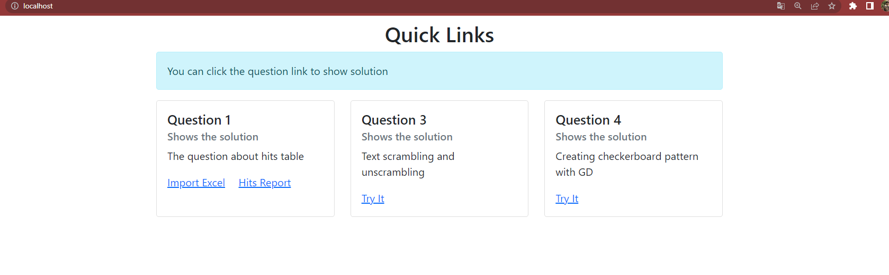
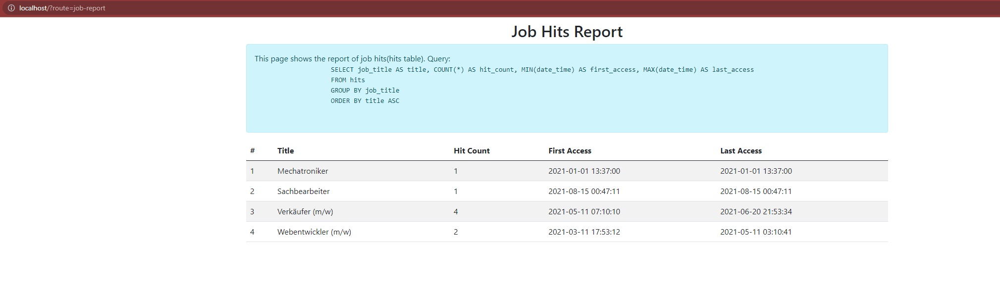
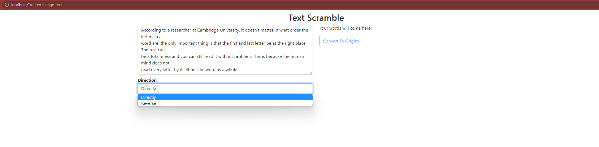
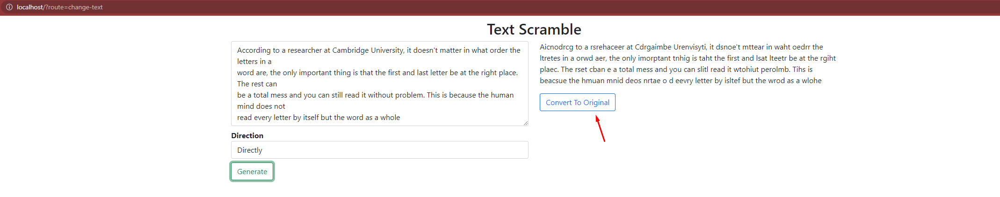

<h2>Challange</h2>

<ul>
    <li>
        <a href="#introduction">Introduction</a>
        <ul><li><a href="#project-structure">Project Structure</a></li></ul>
    </li>
    <li><a href="#installation">Installation</a></li>
    <li>
        <a href="#answers">Answers & Solutions</a>
        <ul>
            <li><a href="#homePage">Home Page</a></li>
            <li><a href="#question1">Answer To Question 1</a></li>
            <li><a href="#question2">Answer To Question 2</a></li>
            <li><a href="#question3">Answer To Question 3</a></li>
            <li><a href="#question4">Answer To Question 4</a></li>
            <li><a href="#question5">Answer To Question 5</a></li>
        </ul>
    </li>
</ul>

    <h2>Introduction</h2>
    
<b>Important: </b> Question 2 and 5 answered in this README file. You can go to base url after project installation to reach quick links of PHP based questions (1, 3, 4)

    

        I created a mini and basic PHP framework (MVC based) to develop this challange and I wanted to show my coding skills.
        Every question has own route except last question. I will describe them on related answers.
    

    
All routes are working with a get parameter named <b>route</b>. For example:

    <code>http://localhost?route=route-name</code> or <code>http://localhost:8000?route=route-name</code>
    
for now I assume the BASE_URL is localhost:8000

    
<b>route-name</b> will be changed for each questions and every route has its own method in related controllers.

    
<b>Note: </b>All routes are defined in src/routes.php

 

     <h2>Project Structure</h2>
     <ul>
        <li>
            src => Application operations folder
            <ul>
                <li>Controllers
                    <ul>
                        <li>BaseController.php => Parent class of all controllers</li>
                        <li>IController.php => An interface to make some dependencies for BaseController</li>
                        <li>ExcelController.php => for Question 1</li>
                        <li>HomeController.php => for quick links</li>
                        <li>TextController.php => for Question 3</li>
                        <li>ImageController.php => for Question 4</li>
                    </ul>
                </li>
                <li>Enums => used to make the project more maintainable
                    <ul>
                        <li>DirectionEnum.php => to define some enums for Question 3</li>
                    </ul>
                </li>
                <li>Exceptions
                    <li>ControllerNotFoundException.php</li>
                    <li>RouteNotFoundException.php</li>
                </li>
                <li>
                    Helpers
                    <ul>
                        <li>TextHelper.php (for text scrambling operations)</li>
                    </ul>
                </li>
                <li>Models => for Question 1
                    <ul>
                        <li>JobModel.php (for hits table)</li>
                    </ul>
                </li>
                <li>Views  
                    <ul>
                        <li>job-report.php => for Question 1</li>
                        <li>text-scrambler.php => for Question 3</li>
                    </ul>
                </li>
                <li>routes.php => All application routes</li>
                <li>index.php => projects base file</li>
                <li>config.php => project configs (DB and BASE_URL)</li>
            </ul>
        </li>
     </ul>
 

    <h2>Installation</h2>
    <ul>
        <li>clone this repo to your environment</li>
        <li>run <code>composer install</code> command to setup project</li>
        <li>Go to projects document root (index.php in base path) on browser after start your web server </li>
        <li>You must edit the <b>BASE_URL</b> variable in config.php file to access application</li>
        <li>You must also edit the database credentials in config.php file.</li>
    </ul>

    

    <h2>Answers</h2>
    <h3 id="question1">Question 1: </h3>
    

        
    

    

        a) I did it with PHP script. I wrote a method named <b>getJobReport</b> which imports hits.xlsx file in base path to MySQL table with PDO.
        This method in src/Controllers/ExcelController and you can run it with going to this route:  
        <code>http://localhost:8000?route=import-excel</code>
    

    
b)
        <code>
            SELECT job_title AS title, COUNT(*) AS hit_count, MIN(date_time) AS first_access, MAX(date_time) AS last_access 
            FROM hits 
            GROUP BY job_title 
            ORDER BY hit_count ASC
        </code>
    

    
c) Without further information about the specific requirements and constraints of the system, it's difficult to provide a definitive answer on how to normalize the database structure. However, as a general guideline, normalization aims to reduce data redundancy and improve data integrity by organizing the data into logical, related tables that represent distinct entities and relationships between them.
        Based on the information provided, a possible normalization approach could involve separating the "hits" information into a separate table, with columns for "id", "job_id", and "datetime". This would allow for a one-to-many relationship between the "jobs" table and the "hits" table, where each job can have multiple hits associated with it.
        The resulting table structure could look something like this:
        <ul>
            <li>
                jobs
                <ul>
                    <li>id (primary key)</li>
                    <li>title</li>
                    <li>id (primary key)</li>
                </ul>
            </li>
        </ul>
         <ul>
            <li>
                hits
                <ul>
                    <li>id (primary key)</li>
                    <li>job_id (foreign key to jobs.id)</li>
                    <li>date_time</li>
                </ul>
            </li>
        </ul> 
    

The following query will perform this structural change:

    <code>
CREATE TABLE jobs (
    job_id INT PRIMARY KEY,
    job_title VARCHAR(255)
);

CREATE TABLE hits (
id INT PRIMARY KEY,
job_id INT,
date_time DATETIME,
FOREIGN KEY (job_id) REFERENCES jobs(job_id)
);
</code>

With this structure, the original query for "the amount of hits per job, the point in time where the first and the point in time where the last access occurred" could be rewritten as follows:

    <code>
        SELECT j.title, COUNT(h.id) AS hit_count, MIN(h.datetime) AS first_access, MAX(h.datetime) AS last_access
        FROM jobs j
        LEFT JOIN hits h ON j.id = h.job_id
        GROUP BY j.id
    </code>

<h3 id="question2">Question 2</h3>

When working with database queries that contain user-input, there are several risks that can come up. One of the most common risks is SQL injection, where malicious users can insert their own SQL code into a query in order to manipulate the database. This can lead to data loss or unauthorized access to sensitive information.

To counteract these risks, it is important to use parameterized queries and prepared statements when interacting with the database. Parameterized queries allow the application to pass parameters to the database separately from the SQL code, making it more difficult for malicious users to manipulate the query. Prepared statements, on the other hand, can help prevent SQL injection by allowing the database to separate the SQL code from the user-input data. Additionally, it is important to validate and sanitize user-input data before passing it to the database to ensure that it does not contain any malicious code.

<h3 id="question3">Question 3: </h3>

Project Route: <code>http://localhost:8000?route=change-text</code>

    
    
    
In the first image there are two options: Directly and Reverse. Directly means convert original text to scrambled text. Reverse means convert scrambled text to its original version.

    
You can click <b>Convert To Original</b> button after generate a scrambled string.

    
Or you can select <b>Reverse</b> option and click <b>Generate</b> button to unscramble the scrambled text previously

<h3 id="question4">Question 4: </h3>
    
Go to the route: <code>http://localhost:8000?route=create-image&width=200&height=200&fieldWidth=20</code>

<h3 id="question5">Question 5: </h3>
<h4>script.sh</h4>
<pre>
    #!/bin/bash
    backup_dirs="/var/www/applicant /var/www/test" #Define the directories to be backed up
    backup_dir="/mnt/backuptest" #Define the backup directory
    backup_file_name="$(date '+%Y%m%d').tar.bz2" #Create the backup file name with the current date
    tar -cjf "${backup_dir}/${backup_file_name}" ${backup_dirs} #Archive the directories and save the archive to the backup directory
    
    #Remove any old backup files if there are more than 5 in the backup directory
    backup_file_count=$(ls -1 ${backup_dir}/*.tar.bz2 | wc -l)
    if [[ ${backup_file_count} -gt 5 ]]; then
        oldest_file=$(ls -tr ${backup_dir}/*.tar.bz2 | head -1)
        rm "${oldest_file}"
    fi
</pre>

    You must add a line to crontab with running this command on your terminal: <code>crontab -e</code>

After run this command you should add this line to file: 
    <code>15 1 * * * /path/to/script.sh</code>

